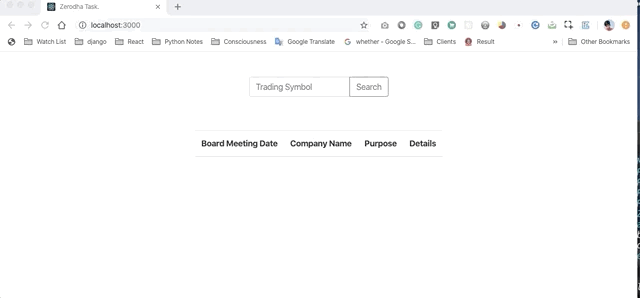

## Go developer task

#### How to use?

1. ```bash 
    git clone https://github.com/rahul-soni11/Go-developer-task-Zerodha.git 
    ```

2. ```bash
    cd Go-developer-task-Zerodha
   ```
3. ```bash
    go run main.go
    ```
4. Visit [127.0.0.1:2222](http://127.0.0.1:2222)
5. Type Trading Symbol to fetch details




© [Rahul Soni](https://www.linkedin.com/in/rahulsoni11/)